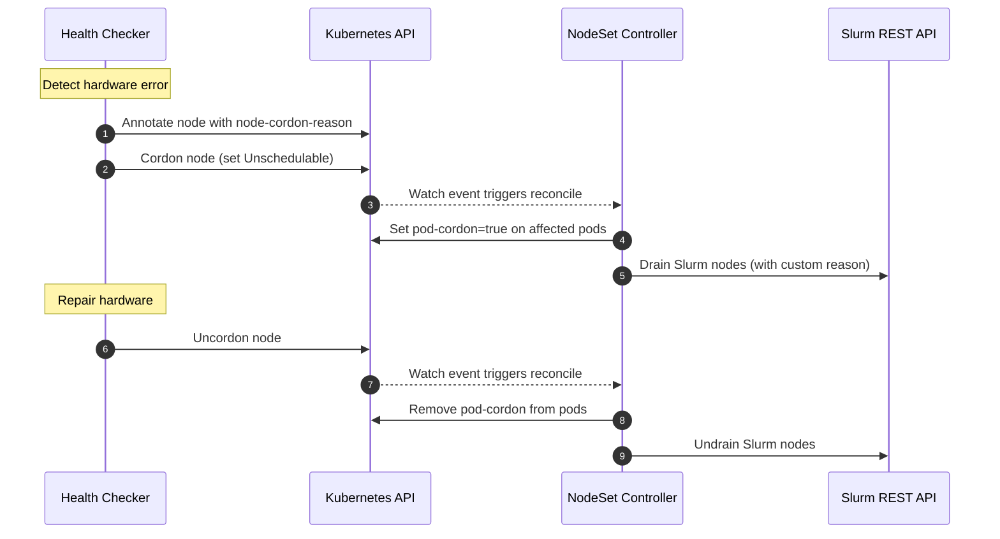

# NodeSet Operations

This guide documents how external tools — health checkers, custom automation,
monitoring systems — can interact with NodeSets using Kubernetes-native
primitives. For design-level details, see
[NodeSet Controller](../concepts/nodeset-controller.md).

## Table of Contents

<!-- mdformat-toc start --slug=github --no-anchors --maxlevel=6 --minlevel=1 -->

- [NodeSet Operations](#nodeset-operations)
  - [Table of Contents](#table-of-contents)
  - [Querying Slurm State from Kubernetes](#querying-slurm-state-from-kubernetes)
  - [Cordoning Pods](#cordoning-pods)
  - [Custom Drain Reasons](#custom-drain-reasons)
    - [Dynamically from Node Conditions](#dynamically-from-node-conditions)
    - [Override with Node Annotation](#override-with-node-annotation)
  - [Influencing Scale-in Order](#influencing-scale-in-order)
    - [Pod Deletion Cost](#pod-deletion-cost)
    - [Pod Deadline](#pod-deadline)
  - [Workload Disruption Protection](#workload-disruption-protection)
  - [External Drain Preservation](#external-drain-preservation)
  - [External Health Checker Integration Pattern](#external-health-checker-integration-pattern)
  - [Node Identity](#node-identity)
    - [Naming Conventions](#naming-conventions)
    - [DaemonSet Mode](#daemonset-mode)
    - [StatefulSet Mode](#statefulset-mode)
      - [Node Pinning](#node-pinning)
        - [Kubernetes Node Names in Slurm](#kubernetes-node-names-in-slurm)
    - [Pruning Slurm Node Records](#pruning-slurm-node-records)

<!-- mdformat-toc end -->

## Querying Slurm State from Kubernetes

The operator projects Slurm node states onto pod conditions with the prefix
`SlurmNodeState`. You can query these without direct access to the Slurm REST
API.

Check if a Slurm node is drained:

```sh
kubectl get pod <pod> -o jsonpath='{.status.conditions[?(@.type=="SlurmNodeStateDrain")]}'
```

Get the drain reason:

```sh
kubectl get pod <pod> -o jsonpath='{.status.conditions[?(@.type=="SlurmNodeStateDrain")].message}'
```

Check if a Slurm node is idle:

```sh
kubectl get pod <pod> -o jsonpath='{.status.conditions[?(@.type=="SlurmNodeStateIdle")].status}'
```

To determine if a node is **busy** (running work), check whether any of the
`Allocated`, `Mixed`, or `Completing` conditions are `True`:

```sh
kubectl get pod <pod> -o jsonpath='{range .status.conditions[?(@.status=="True")]}{.type}{"\n"}{end}' \
  | grep -E 'SlurmNodeState(Allocated|Mixed|Completing)'
```

A node is **drained** when `SlurmNodeStateDrain` is `True`,
`SlurmNodeStateUndrain` is not `True`, and the node is not busy. A node is
**draining** when those same drain conditions hold but the node is still busy.

## Cordoning Pods

To trigger a Slurm drain from the Kubernetes side, set the `pod-cordon`
annotation on a NodeSet pod:

```sh
kubectl annotate pod <pod> nodeset.slinky.slurm.net/pod-cordon=true
```

The operator will detect this annotation and drain the corresponding Slurm node.
To verify the drain took effect:

```sh
kubectl get pod <pod> -o jsonpath='{.status.conditions[?(@.type=="SlurmNodeStateDrain")].status}'
```

To reverse the drain, remove the annotation:

```sh
kubectl annotate pod <pod> nodeset.slinky.slurm.net/pod-cordon-
```

The operator will undrain the Slurm node, provided the Kubernetes node is not
cordoned and the drain reason was set by the operator.

## Custom Drain Reasons

When a Kubernetes node is cordoned, the operator cordons all NodeSet pods on the
Kubernetes node by ensure the Slurm node is drained. By default, the drain
reason propagated to Slurm is a generic message.

It should be noted that the operator always prefixed the Slurm node drain reason
with `slurm-operator:`. This is done to indicate if the reason was set by the
operator, or some other source. If set by the operator, it can freely manage the
drain state, otherwise it will not make changes to drain state until cleared by
the other source.

To customize the drain reason, either configure the operator with
`propagatedNodeConditions`, or set the `node-cordon-reason` annotation on
Kubernetes nodes. See sections below for details.

### Dynamically from Node Conditions

It is common for tooling to set Kubernetes node conditions to indicate status of
the node, especially to report problems. Remediation tooling typically triggers
off of certain node conditions to take action, such as cordoning or draining the
node due to system instability or failure.

The operator can be configured to use those same node conditions when generating
the Slurm node drain reason, keeping Kubernetes and Slurm context in sync. When
installing or upgrading the slurm-operator helm chart, set a non-empty value for
`propagatedNodeConditions`, where the value is a list of Kubernetes
[node conditions][node-condition], by the type field. Each matching node
condition type is formatted and joined to generate the final Slurm node drain
reason.

For example, you have [Node Problem Detector][node-problem-detector] (NPD)
running in your Kubernetes cluster with a custom plugin for hardware monitoring
which defines a `CPUProblem` and `GPUProblem` condition type, and you want to
propagate them to Slurm automatically. In the slurm-operator's values.yaml, you
would add the node condition types `CPUProblem` and `GPUProblem` to the
`propagatedNodeConditions` list.

```yaml
propagatedNodeConditions:
  - CPUProblem
  - GPUProblem
```

Let's assume your NPD plugins each reported a CPU and GPU issue by updating the
Kubernetes node condition with the following.

```yaml
status:
  conditions:
  - type: CPUProblem
    reason: BadCPU
    message: "CPU 17: Machine Check Exception"
  - type: GPUProblem
    reason: GpuCountMismatch
    message: "GPU count mismatch detected: Node has 3, expected 4"
```

Then, when that Kubernetes node is cordoned, the Slurm node drain message would
be the following.

```console
$ scontrol show node node-0 | grep -Po "NodeName=[^ ]+|[ ]+Reason=[^\[\]]+"
NodeName=node-0
   Reason=slurm-operator: (BadCPU: CPU 17: Machine Check Exception); (GpuCountMismatch: GPU count mismatch detected: Node has 3, expected 4)
```

### Override with Node Annotation

To provide a custom reason, set the `node-cordon-reason` annotation on the
Kubernetes node **before** cordoning it:

```sh
kubectl annotate node <node> nodeset.slinky.slurm.net/node-cordon-reason="GPU ECC error detected"
kubectl cordon <node>
```

When the Kubernetes node is cordoned, the Slurm node drain message would be:

```console
$ scontrol show node node-0 | grep -Po "NodeName=[^ ]+|[ ]+Reason=[^\[\]]+"
NodeName=node-0
   Reason=slurm-operator: GPU ECC error detected
```

To clean up after uncordoning:

```sh
kubectl uncordon <node>
kubectl annotate node <node> nodeset.slinky.slurm.net/node-cordon-reason-
```

## Influencing Scale-in Order

When a NodeSet scales in, pods are sorted to determine which ones are deleted
first. The full sort order (first match wins):

1. Unassigned pods before assigned pods
1. `Pending` phase before `Unknown` before `Running`
1. Not-ready pods before ready pods
1. Lower `pod-deletion-cost` before higher
1. Earlier `pod-deadline` before later
1. Cordoned pods before uncordoned pods
1. Higher ordinal before lower ordinal
1. More recently ready before longer-ready
1. More recently created before older

The following are the annotations are honored on a best-effort basis and do not
guarantee deletion order.

### Pod Deletion Cost

Using the `nodeset.slinky.slurm.net/pod-deletion-cost` annotation, users can set
a preference regarding which pods to remove first when downscaling a NodeSet.

The annotation should be set on the pod, the range is [-2147483648, 2147483647].
It represents the cost of deleting a pod compared to other pods belonging to the
same NodeSet. Pods with **lower** deletion cost are preferred to be deleted
before pods with higher deletion cost.

The implicit value for this annotation for pods that don't set it is 0; negative
values are permitted. Invalid values will be rejected by the API server.

```sh
# Protect this pod from early deletion
kubectl annotate pod <pod> nodeset.slinky.slurm.net/pod-deletion-cost=1000

# Mark this pod as expendable
kubectl annotate pod <pod> nodeset.slinky.slurm.net/pod-deletion-cost=-100
```

The implicit cost for pods without this annotation is `0`. Negative values are
permitted.

### Pod Deadline

The `nodeset.slinky.slurm.net/pod-deadline` is an RFC 3339 timestamp. The
operator updates this annotation based on the pod's running Slurm workload. Pods
with **earlier** deadlines are preferred to be deleted before pods with
**later** deadlines.

## Workload Disruption Protection

When `spec.workloadDisruptionProtection` is enabled on a NodeSet, the operator
dynamically labels busy pods with `nodeset.slinky.slurm.net/pod-protect`. A
PodDisruptionBudget (PDB) matches this label to prevent Kubernetes from evicting
pods that are actively running Slurm work.

A pod is considered **busy** when any of the following Slurm states are `True`:
`Allocated`, `Mixed`, or `Completing`.

When a busy pod's Slurm workload completes and the node returns to an idle
state, the operator removes the `pod-protect` label, allowing normal eviction.

To check if a specific pod is currently protected:

```sh
kubectl get pod <pod> -o jsonpath='{.metadata.labels.nodeset\.slinky\.slurm\.net/pod-protect}'
```

## External Drain Preservation

The operator prefixes all drain reasons it sets with `slurm-operator:`. When the
operator encounters a Slurm node whose drain reason does **not** have this
prefix, it treats the reason as externally owned and takes no action:

- The operator will **not** overwrite or clear the external drain.
- The operator will **not** uncordon pods whose Slurm nodes have external drain
  reasons.
- The external drain persists until the external tool or administrator clears it
  directly in Slurm.

This means that drains set via `scontrol` or other Slurm management tools are
preserved across operator reconciliation cycles.

## External Health Checker Integration Pattern

External health checkers can integrate with NodeSets using Kubernetes node
annotations and cordon/uncordon operations. The operator handles the Slurm-side
drain lifecycle automatically.

The end-to-end flow for a hardware error detection and recovery cycle:



See [Override with Node Annotation](#override-with-node-annotation) and
[Cordoning Pods](#cordoning-pods) for the kubectl commands used in each step.

## Node Identity

A NodeSet's `scalingMode` determines whether its Pods, which represent Slurm
nodes, are loosely or strictly mapped to the Kubernetes Nodes they run on.

### Naming Conventions

Slurm node names follow one of two conventions:

- **Node-derived naming:** the Kubernetes Node's
  `nodeset.slinky.slurm.net/hostname-override` value, if set, otherwise the Node
  name up to the first dot.
- **Pod-hostname naming:** the Pod template hostname prefix plus ordinal, or the
  Pod name if no prefix is set. StatefulSet workers using host networking use the
  Kubernetes Node name instead.

### DaemonSet Mode

When using `scalingMode=DaemonSet`, NodeSet Pods are strictly mapped to
Kubernetes Nodes and always use [Node-derived naming](#naming-conventions) for
their hostname and Slurm node name.

### StatefulSet Mode

When using `scalingMode=StatefulSet`, NodeSet Pods may be loosely mapped to
Kubernetes Nodes and may be rescheduled freely. They use
[Pod-hostname naming](#naming-conventions) by default.

If a stricter node mapping is preferred, node pinning can be enabled on the
NodeSet.

#### Node Pinning

When enabled, each NodeSet Pod is pinned to the Kubernetes Node it was first
scheduled on. Subsequent recreations of that Pod (e.g. after eviction, deletion,
or node maintenance) return to the same Node while the pin remains valid. If the
Node is unavailable, the Pod remains in `Pending` state until the Node comes
back. The pin is removed if the Node no longer exists or no longer matches the
Pod template (e.g. affinity, nodeSelector).

To use node pinning, set `pinToNode=true` on a NodeSet in the Slurm Helm chart:

```yaml
nodesets:
  slinky:
    pinToNode: true
```

Or directly in the NodeSet CR:

```yaml
apiVersion: slinky.slurm.net/v1beta1
kind: NodeSet
metadata:
  name: gpu-workers
spec:
  pinToNode: true
  replicas: 4
```

With node pinning enabled:

1. The Pod is initially scheduled normally.
1. The controller records the node-to-pod mapping in `status.nodeToOrdinal`.
1. On subsequent pod recreations, a [node affinity][node-affinity] is added to
   the pod such that it can only be scheduled to the recorded node.
1. The controller resets the node in the node-to-pod map if:
   - the Kubernetes node no longer exists
   - the NodeSet pod template no longer matches the recorded Kubernetes Node
     (e.g. affinity, nodeSelector).

##### Kubernetes Node Names in Slurm

Pinning controls placement; setting `spec.preferKubernetesNodeName` to `true`
selects [Node-derived naming](#naming-conventions) for pinned StatefulSet workers.
This boolean defaults to `false` when omitted or set to YAML `null`. The
preference takes effect only with both `pinToNode: true` and
`oversubscribeNode: false`.

These fields can be set on the NodeSet's `spec` or its entry in the Slurm Helm
chart's `nodesets` map. Disabling pinning or enabling oversubscription falls back
to Pod-hostname naming.

Resolved names must be valid Pod hostnames (a DNS label of at most 63 characters).
The binding webhook rejects invalid names before the Pod starts.

During autoscaling, worker Pods can wait for Nodes that do not exist yet. Their
Slurm names remain unresolved until binding; unresolved workers are excluded
from Slurm operations while still counting toward Kubernetes replicas.

The preference itself is immutable after creation, but `pinToNode` and
`oversubscribeNode` remain mutable.

The slurmd container exposes `SLURM_NODE_NAME` in both scaling modes, and the
default termination hook uses it. For StatefulSet workers using Node-derived
naming, the variable comes from the recorded hostname label through the Downward
API and is passed to slurmd's native `-N` option. Custom images and startup
overrides must preserve the recorded Slurm identity. The
`nodeset.slinky.slurm.net/slurm-node-name-mode` Pod label is reserved for the
operator.

To change the preference itself, create a new NodeSet and retire the old one
after draining its workloads. Existing NodeSets default to `false`; upgrading
does not opt them in or rename their workers.

If a pin is released, the replacement Pod can run on another Node and register
under that Node's name. Existing scheduling and eviction policies still apply;
this option does not force deletion of Pods on `NotReady` Nodes.

For cleanup of Slurm records after node replacement, see
[Pruning Slurm Node Records](#pruning-slurm-node-records).

### Pruning Slurm Node Records

`spec.pruneSlurmNodeRecords` controls cleanup of owned, defunct Slurm node
records. The default `Never` policy leaves records in place for manual cleanup.
Set it to `NodeNotFound` to allow the operator to remove records after their
Node-backed identity changes or their pin is lost, including records left behind
by hostname overrides.

In the Slurm Helm chart:

```yaml
nodesets:
  slinky:
    pruneSlurmNodeRecords: NodeNotFound
```

This field can also be set directly on the NodeSet's `spec`. A valid pin retains
the record across Pod restarts. Deleting a Pod does not itself delete its Slurm
record.

<!-- Links -->

[node-affinity]: https://kubernetes.io/docs/concepts/scheduling-eviction/assign-pod-node/#node-affinity
[node-condition]: https://kubernetes.io/docs/reference/node/node-status/#condition
[node-problem-detector]: https://github.com/kubernetes/node-problem-detector
